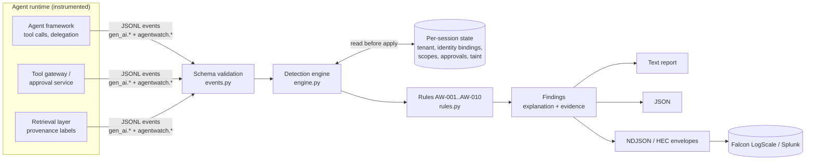

# agentwatch

**Behavioral detection for AI agent execution telemetry.**

agentwatch is a reference implementation that replays normalized agent telemetry, including tool calls, delegation, approvals, and content provenance, through a set of explainable detection rules. It is written for detection engineers who need to answer questions such as "did an agent act across tenants?", "did anything irreversible run without a human saying yes?", and "does this session look like an indirect prompt injection that turned into exfiltration?"

It is a standalone Python package with no runtime dependencies. All data in this repository is synthetic.

## Five-minute tour

```bash
git clone https://github.com/achandra-security/agentwatch && cd agentwatch
python -m pip install -e ".[dev]"
agentwatch analyze fixtures/indirect_injection_exfil.jsonl
```

```text
# abridged
[CRITICAL] AW-004 Sensitive data read followed by egress to non-allowlisted destination
  session:  s-inject
  agent:    mail-assistant
  why:      Suspicious tool-call sequence by 'mail-assistant': sensitive read ('crm_export_contacts')
            -> egress to non-allowlisted host ('http_post'), within 30 minutes.
  evidence: s-inject-e03, s-inject-e04
  respond:  Block the destination, revoke the agent's egress capability, and scope the disclosure.

[HIGH] AW-003 Privileged action shortly after untrusted content ingestion
  why:      Agent 'mail-assistant' performed an egress action ('http_post') within 15 minutes of
            ingesting untrusted content from: inbound email from external sender.
  evidence: s-inject-e02, s-inject-e04
```

Full output for every fixture is in [`examples/`](examples/).

## What it detects

| Rule | Severity | Detects |
|---|---|---|
| AW-001 | high / critical | Tool call on a resource owned by a different tenant than the session (critical for writes) |
| AW-002 | critical | Irreversible action with no approval, an approval from a non-human, or an explicit denial that was ignored |
| AW-003 | high | Write, irreversible, or egress action shortly after untrusted content entered the session (indirect prompt injection indicator) |
| AW-004 | critical | Sequence: confidential or secret read, then egress to a destination not on the allowlist |
| AW-005 | critical | Sequence: security control change (logging, alerting), then an irreversible action |
| AW-006 | high | Delegation that grants a child agent scopes its parent does not hold |
| AW-007 | medium | Delegation chain deeper than the configured maximum |
| AW-008 | high / medium | Tool call from a workload identity that does not match the agent's binding, or from an agent never bound in the session |
| AW-009 | high | Tool call requiring a scope the agent was not delegated |
| AW-010 | low | Tool-call burst above a rate threshold |

Every finding carries the observed values in plain language, the IDs of the evidence events, the delegation chain back to the root agent, a recommended response, and an OWASP Top 10 for LLM Applications (2025) reference. Run `agentwatch rules` for descriptions.

## Architecture



The engine evaluates each rule against an event before that event updates the session state. Rules therefore see only what was known before the action, which is how an inline enforcement point would see it. Details are in [`docs/architecture.md`](docs/architecture.md), and SIEM integration is covered in [`docs/siem-integration.md`](docs/siem-integration.md).

## Event model

Events are flat attribute maps in the style of OpenTelemetry span attributes. `gen_ai.agent.id`, `gen_ai.tool.name`, `gen_ai.tool.call.id`, and `gen_ai.operation.name` reuse names from the OpenTelemetry GenAI semantic conventions. Everything under `agentwatch.*` is a security extension defined by this project and is not part of any OpenTelemetry specification.

```json
{"event_id": "s-inject-e04", "timestamp": "2026-09-01T14:00:15Z", "session_id": "s-inject",
 "event_type": "tool.call",
 "attributes": {"gen_ai.agent.id": "mail-assistant", "gen_ai.tool.name": "http_post",
                "gen_ai.tool.call.id": "c2", "agentwatch.tool.action_class": "egress",
                "agentwatch.egress.destination": "collector.attacker.example",
                "agentwatch.workload.id": "spiffe://example.test/agents/mail-assistant"}}
```

The event types are `session.start`, `content.ingest`, `tool.call`, `agent.delegate`, `approval.granted`, and `approval.denied`. The full attribute list is in [`agentwatch/events.py`](agentwatch/events.py).

## Usage

```bash
agentwatch analyze fixtures/*.jsonl                          # text report
agentwatch analyze session.jsonl --format json               # findings as JSON
agentwatch analyze session.jsonl --format ndjson             # one alert per line for SIEM ingest
agentwatch analyze session.jsonl --format hec                # HEC envelopes (Splunk / LogScale)
agentwatch analyze session.jsonl --allow-egress api.partner.example
agentwatch analyze session.jsonl --fail-on high              # exit 2 on high+ (CI gating)
agentwatch rules
```

The same engine can be used as a library for streaming:

```python
from agentwatch import DetectionEngine, AgentEvent
engine = DetectionEngine()
for record in stream:                       # your collector
    for finding in engine.process(AgentEvent.from_dict(record)):
        alert(finding.to_dict())
```

## Synthetic fixtures

| File | Scenario | Expected |
|---|---|---|
| `benign_session.jsonl` | Tenant-scoped retrieval and a scoped write | no findings |
| `indirect_injection_exfil.jsonl` | Untrusted email, then confidential CRM export, then POST to an unknown host | AW-003, AW-004 |
| `cross_tenant_retrieval.jsonl` | Tenant A session reads, then writes, tenant B vectors | AW-001 ×2 |
| `unapproved_destructive_actions.jsonl` | Approved delete (clean), unapproved delete, self-approval, audit tampering, then a run after denial | AW-002 ×3, AW-005 |
| `delegation_abuse.jsonl` | Scope escalation, deep chain, workload mismatch, out-of-scope tool, unbound agent | AW-006, AW-007, AW-008 ×2, AW-009 |

To regenerate them, run `python fixtures/generate_fixtures.py`. All tenants, users, hosts, and SPIFFE IDs are fictional (`example.test`).

## Tests

```bash
python -m pytest -v
```

The tests cover every rule's positive and negative cases, time-window expiry, sequence ordering, session isolation, schema validation errors, deterministic output regardless of input order, all fixtures, and every CLI output format. CI runs the suite on Python 3.10, 3.11, and 3.12, and checks that the benign fixture produces zero findings.

## Security assumptions and limitations

- **The telemetry is trusted to be accurate.** agentwatch detects behavior as reported. A compromised runtime that lies in its telemetry is out of scope, so emit events from the tool gateway rather than from the agent process where possible.
- **Action classes and sensitivity labels come from the emitter.** If a destructive tool is labelled `read`, AW-002 will not fire. Classification belongs in the tool registry, not the model.
- **AW-003 is an indicator, not proof of prompt injection.** It will fire on legitimate "summarize this email and file a ticket" workflows. Tune the window or suppress by tool.
- **This is offline, batch or in-process analysis.** There is no persistence, no cross-session correlation, and no inline blocking. For enforcement at the tool boundary, see [agent-authorization-reference](https://github.com/achandra-security/agent-authorization-reference).
- **The SIEM queries and field mappings in `docs/` are illustrative.** They have not been validated against a live LogScale or Splunk tenant.
- **Workload identity values are strings compared for equality.** agentwatch does not verify SVIDs or tokens cryptographically.

## Roadmap (not implemented)

- An adapter that converts OTLP/JSON spans from GenAI-instrumented frameworks into agentwatch events
- Cross-session correlation, such as the same destination across tenants
- A rule configuration file (YAML) and per-rule suppressions
- Native LogScale and Splunk detection content packs

## License

MIT. This is original code written as a public reference implementation. It contains no employer code, configurations, or data.
