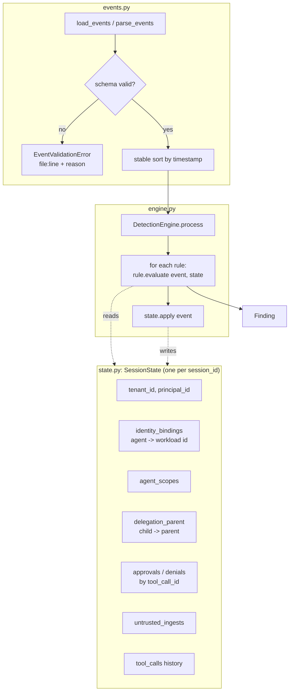
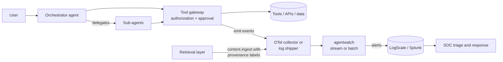

# Architecture

## Design goals

1. **Explainability first.** Every finding must be understandable by an analyst without reading code. That means it states the observed values, the evidence event IDs, and the delegation chain.
2. **Deterministic.** Given the same events, the engine produces the same findings in the same order, whatever order the input arrives in. There are no model calls in the detection path.
3. **Point-in-time correctness.** Rules see session state as it was *before* the event under evaluation. This mirrors what an inline enforcement point could know, and it prevents an event from vouching for itself. For example, an approval arriving after the irreversible call does not count.
4. **Telemetry you can actually emit.** The schema needs only fields that a tool gateway, an approval service, and a retrieval layer already know.

## Components



### Rule types

- **Point rules** (AW-001, AW-002, AW-006 to AW-009) inspect one event against the state.
- **Windowed rules** (AW-003, AW-010) compare the event to recent history inside a configurable time window.
- **Sequence rules** (AW-004, AW-005) subclass `SequenceRule`. They declare an ordered tuple of predicates and fire when the current tool call matches the last predicate and earlier calls in the same session match the others, in order, within `sequence_window`. Adding a new sequence takes about ten lines:

```python
class SecretsThenNewTool(SequenceRule):
    rule_id, title, severity = "AW-100", "Secret read then first-seen tool", "high"
    steps = (lambda e, c: e.get("agentwatch.data.sensitivity") == "secret",
             lambda e, c: e.get("gen_ai.tool.name") not in KNOWN_TOOLS)
    step_labels = ("secret read", "unknown tool")
```

### Identity and delegation model

- `session.start` binds the root agent to a workload identity (for example a SPIFFE ID string) and records its scopes, the principal, and the tenant.
- `agent.delegate` records a parent-to-child edge, the child's scopes, and optionally the child's workload identity.
- `delegation_chain(agent)` walks parent edges back to the root, with a cycle guard. Findings include this chain so an analyst can see which human principal ultimately owns the action.

## Where it sits in a real deployment



The tool gateway is the right place to emit `tool.call`, `approval.*`, and identity fields. It sits outside the agent's control and already knows the verified caller identity. The agent process itself should be treated as untrusted.

## Complexity

Per event, point rules run in O(1). Windowed and sequence rules scan the session's tool-call history, which is O(n) per event in the worst case. That is acceptable for reference use and for sessions of hundreds of calls. A production stream processor would keep bounded windows instead.
