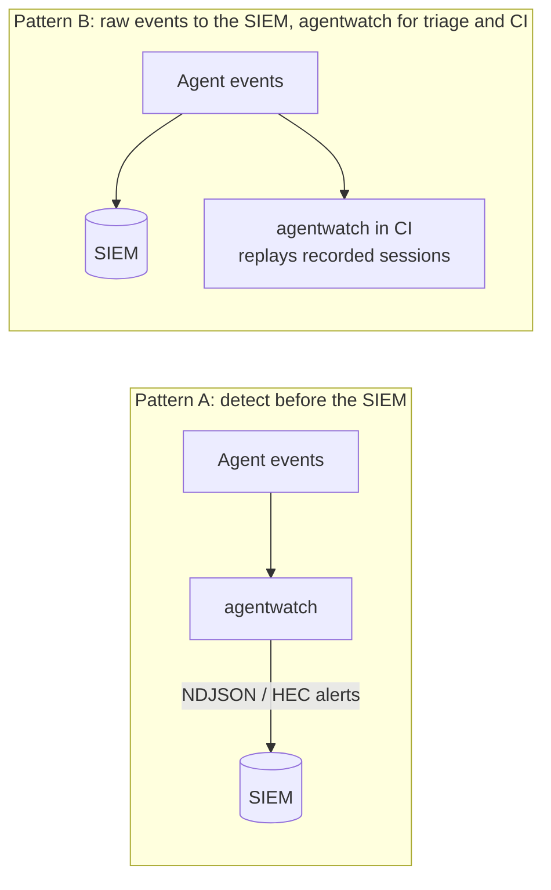

# SIEM integration

agentwatch only formats alerts. It has no network code and never handles SIEM credentials. The patterns below show how its output is meant to flow into a SIEM.

> **Status:** The field mappings and queries on this page are illustrative. They have not been tested against a live CrowdStrike Falcon LogScale or Splunk tenant. Validate the parser, field names, and query syntax in your own environment before relying on them.

## Two deployment patterns



- **Pattern A** keeps detection logic in version-controlled, unit-tested Python and sends only alerts. It keeps SIEM ingest volume low.
- **Pattern B** keeps raw telemetry in the SIEM for hunting. agentwatch then runs as a regression gate: record an agent session in test, replay it with `--fail-on high`, and fail the build if a code change introduces a cross-tenant call or an unapproved destructive action.

## Output formats

| Format | Command | Use |
|---|---|---|
| `ndjson` | `agentwatch analyze s.jsonl --format ndjson` | One JSON alert per line, for file shippers (Falcon LogScale Log Collector, Splunk Universal Forwarder, Fluent Bit) |
| `hec` | `agentwatch analyze s.jsonl --format hec` | HTTP Event Collector envelopes `{"time", "source", "sourcetype", "event"}` for a HEC-style ingest endpoint |

Alert fields: `@timestamp`, `event.kind` (`alert`), `event.module` (`agentwatch`), `rule.id`, `rule.name`, `event.severity` (0 to 100), `agentwatch.severity`, `agentwatch.session_id`, `gen_ai.agent.id`, `agentwatch.delegation_chain`, `agentwatch.evidence_event_ids`, `message`, and `agentwatch.response`. The names loosely follow Elastic Common Schema conventions, so they stay recognizable across SIEMs.

## CrowdStrike Falcon LogScale

**Ingest.** You can either point the Falcon LogScale Log Collector at a file of `--format ndjson` output, or send `--format hec` envelopes to LogScale's HEC-compatible ingest API using an ingest token that is scoped to a dedicated repository. Assign a JSON parser so that the dotted field names are extracted.

**Example queries** (illustrative):

```
// Alert volume by rule over the search window
event.module = "agentwatch"
| groupBy([rule.id, rule.name], function=count())

// Critical agent alerts with the owning session and delegation chain
event.module = "agentwatch" agentwatch.severity = "critical"
| table([@timestamp, rule.id, gen_ai.agent.id, agentwatch.session_id, message])

// Agents that trip more than one distinct rule: candidates for credential suspension
event.module = "agentwatch"
| groupBy([gen_ai.agent.id], function=count(rule.id, distinct=true, as=rules))
| rules > 1
```

## Splunk

**Ingest.** Send `--format hec` output to `/services/collector/event` with a HEC token restricted to an `agentwatch` index. Set `sourcetype=agentwatch:finding` with `KV_MODE=json`.

**Example searches** (illustrative):

```
index=agentwatch sourcetype="agentwatch:finding"
| stats count by rule.id, rule.name

index=agentwatch agentwatch.severity=critical
| table _time rule.id gen_ai.agent.id agentwatch.session_id message

index=agentwatch
| stats dc(rule.id) as rules values(rule.id) as rule_ids by gen_ai.agent.id
| where rules > 1
```

## Mapping raw runtime telemetry into agentwatch events

If your framework already emits OpenTelemetry GenAI spans, map them into agentwatch events at the collector or in a small adapter:

| agentwatch field | Typical source |
|---|---|
| `gen_ai.agent.id`, `gen_ai.tool.name`, `gen_ai.tool.call.id` | GenAI `execute_tool` span attributes |
| `agentwatch.workload.id` | Verified caller identity at the tool gateway (for example the SPIFFE ID from mTLS) |
| `agentwatch.tenant.id`, `agentwatch.resource.tenant` | Session context and the resource's owning tenant from the data layer |
| `agentwatch.tool.action_class`, `agentwatch.tool.required_scope` | Tool registry metadata (never model output) |
| `agentwatch.provenance.trust` | Retrieval layer labels on ingested content |
| `approval.*` events | Human approval service audit log |

The adapter itself is on the roadmap and is not implemented in this repository.
